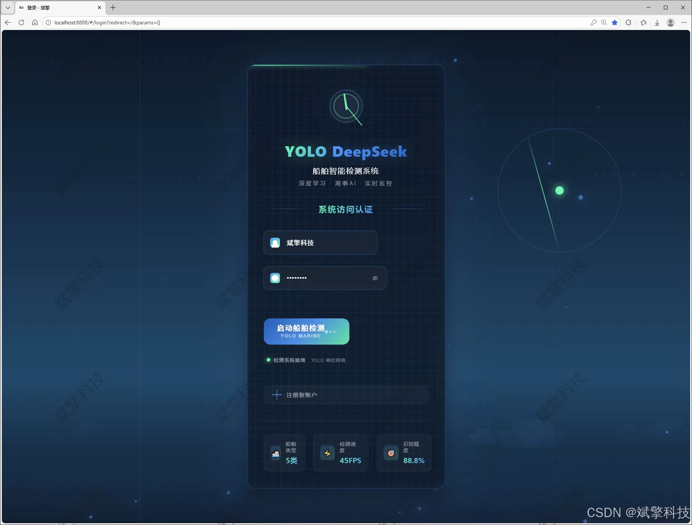
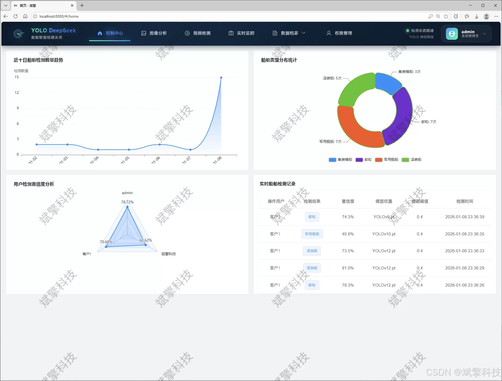
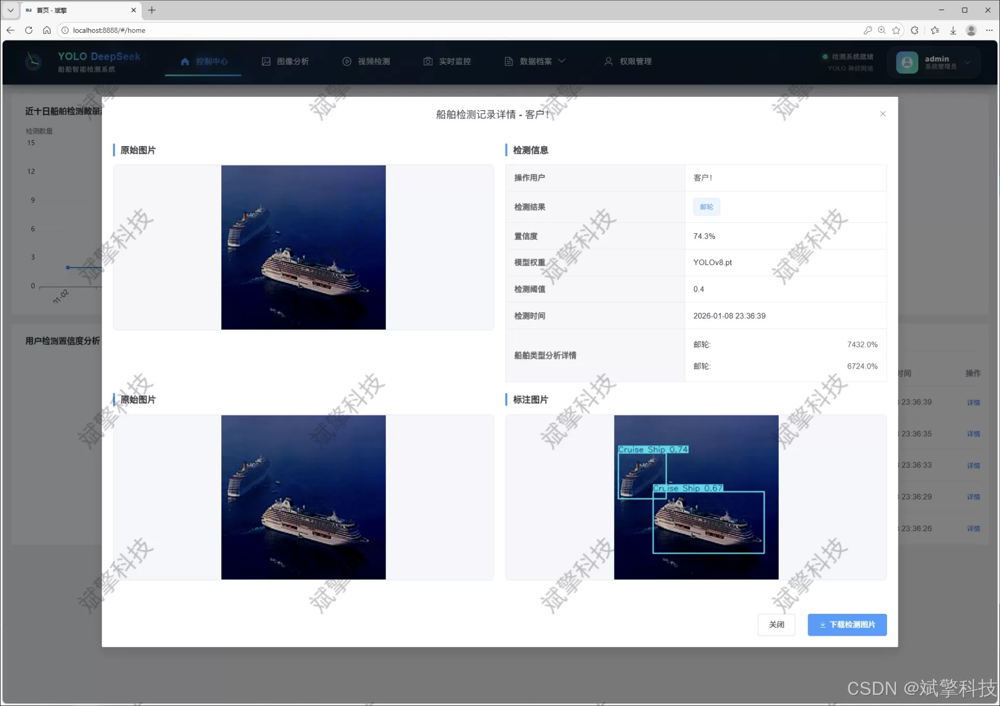
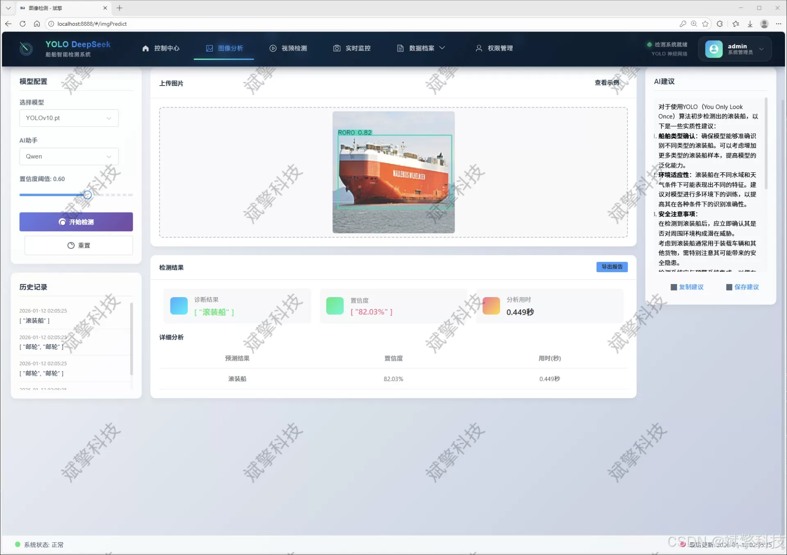
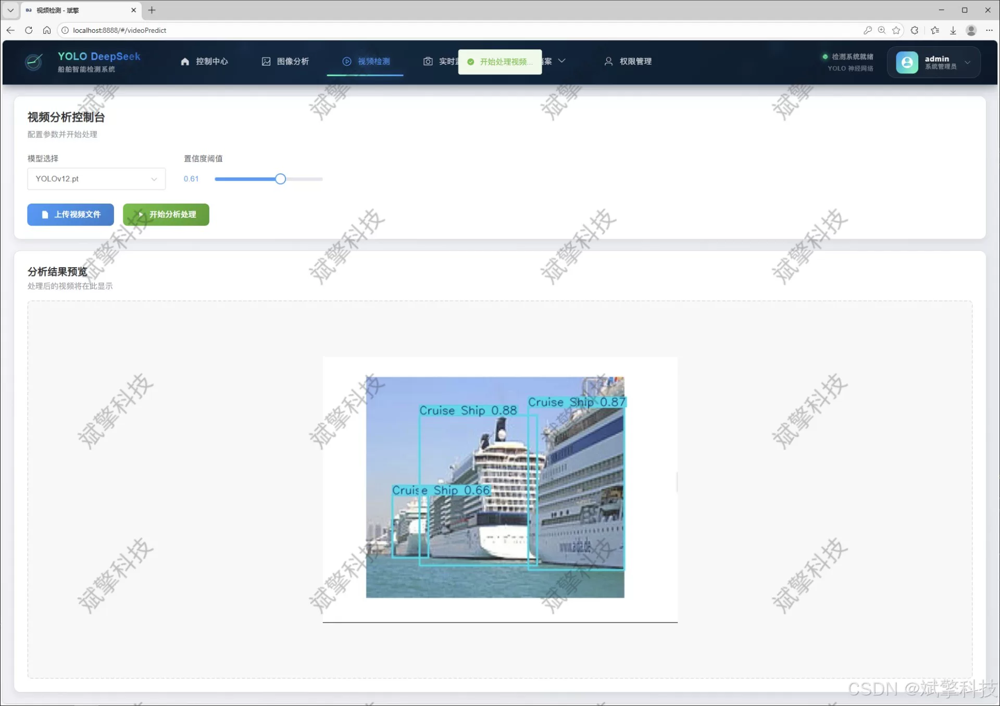
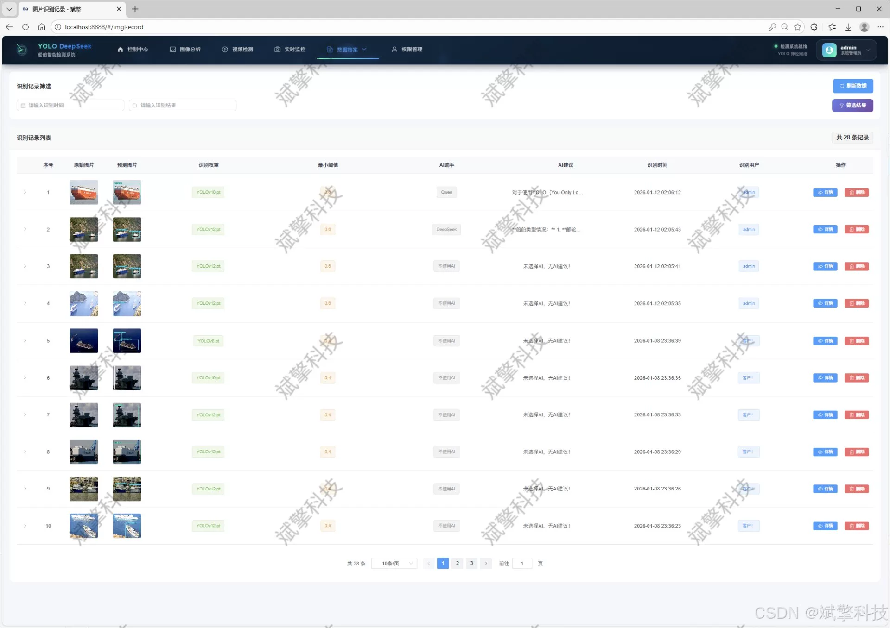
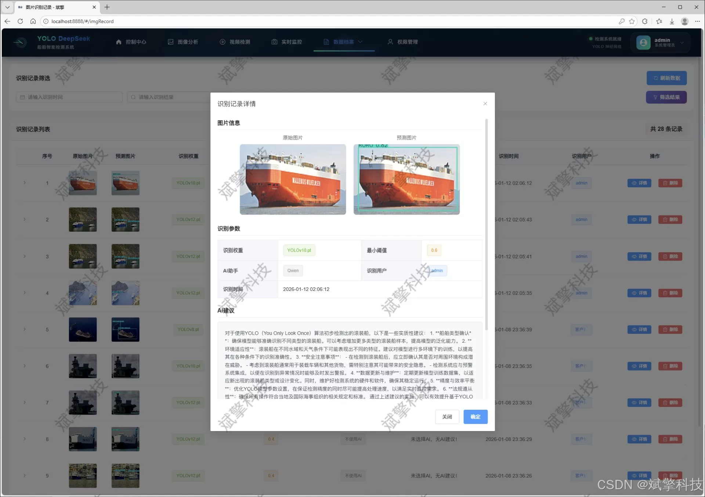
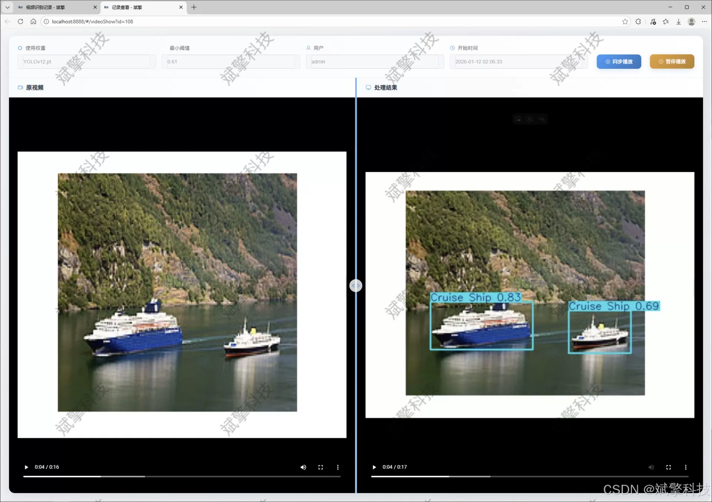
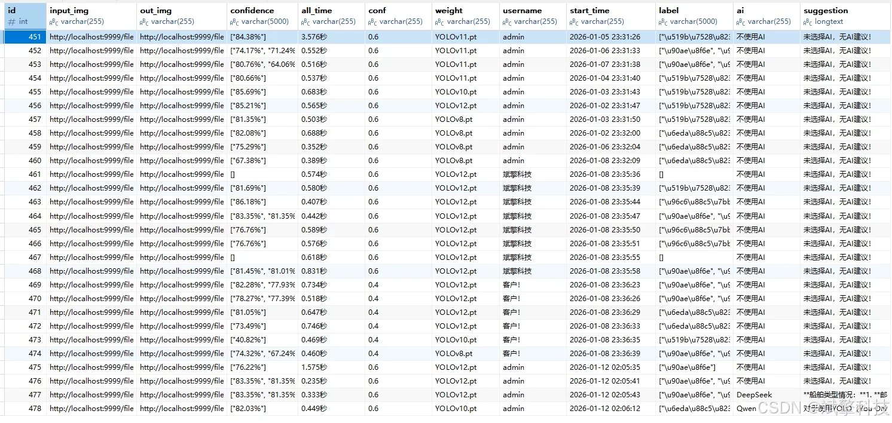

# YOLO for Ship Type Detection

## Body

YOLO (You Only Look Once) is a deep learning-based object detection algorithm that can quickly and accurately detect objects in real-time. It has been widely used in various fields such as autonomous driving, robotics, and image analysis.

In this system, we use the YOLO model to detect the types of ships in images. The YOLO model is a state-of-the-art object detection algorithm that can detect objects in real-time with high accuracy and efficiency. We use the DeepSeek platform, which provides a large dataset of labeled images for training and testing the YOLO model.

The system consists of three main components: the DeepSeek intelligent analysis module, the web interface, and the backend server. The DeepSeek intelligent analysis module is responsible for analyzing the input images and generating output labels. The web interface allows users to interact with the system through a web browser, while the backend server processes the data and generates the final results.

The YOLOv8/YOLOv10/YOLOv11/YOLOv12 models are used in this system to improve the accuracy and speed of the object detection process. These models have been trained on large datasets and have achieved state-of-the-art performance in object detection tasks.

Overall, this system combines the strengths of YOLO and DeepSeek to provide a powerful tool for detecting ship types in real-time.

This system is based on the latest generation of YOLOv8, YOLOv10, YOLOv11, and YOLOv12 algorithms, constructing a high-performance ship detection and classification model. The model is specifically trained for five main types of ships (container ships, cruise ships, military ships, roll-on/roll-off ships, tankers). The dataset contains a total of 3721 high-quality labeled images. The system adopts a modern architecture with a front-end and back-end separation, where the back-end is built on SpringBoot to provide stable and scalable RESTful API services; the front-end provides an intuitive and user-friendly Web interaction interface. The core functions include: 1) Multimodal detection: Supports ship detection in image, video files, and real-time streaming media; 2) Multi-model switching: Allows users to dynamically select and use different versions of YOLO models for inference, facilitating performance comparison and algorithm evaluation; 3) AI deep analysis: Integrates the DeepSeek intelligent analysis module to provide deeper insights and interpretations of the detection results; 4) Comprehensive data management: All detection records (including images, videos, real-time streams) are structured stored in a MySQL database, complemented by a powerful information visualization dashboard for display; 5) Complete user system: Includes user registration and login (including password security checks), personal center management, and administrator back-end management modules, realizing system-level permission control and data isolation.

Tests have shown that the system can effectively identify various types of ships in complex sea conditions with high accuracy and fast response. It not only provides a powerful technical tool for maritime supervision and researchers, but also provides a typical practice example for engineering and productizing advanced target detection algorithms, and building a complete data-driven Web application, which has good application value and prospects for promotion.

Functional module

✅ User Login and Registration: Supports password detection, saves to MySQL database.

✅ Supports four YOLO model switches, YOLOv8, YOLOv10, YOLOv11, YOLOv12.

✅ Information Visualization, Data Visualization.

✅ Image detection supports AI analysis functions, deepseek and Qianwen.

✅ Supports image detection, video detection, and real-time camera detection. The results are saved to a MySQL database.

✅ Picture recognition record management, video recognition record management and camera recognition record management.

✅ User Management Module, administrators can add, delete, modify, and query users.

✅ Personal center, can modify their own information, password name profile picture and so on.

There is no Lunwen writing service, nor any Lunwen.

## Images

## Payment

Here is a pay link on Stripe ( https://buy.stripe.com/3cs8yP7sY87d0vu9AB ). Please contact me lonlonago@foxmail.com after funding $89, and I will send you a complete data files , thank you!

